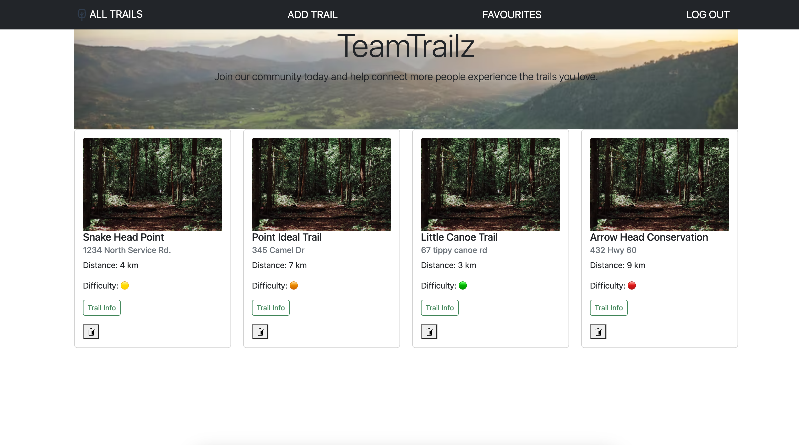
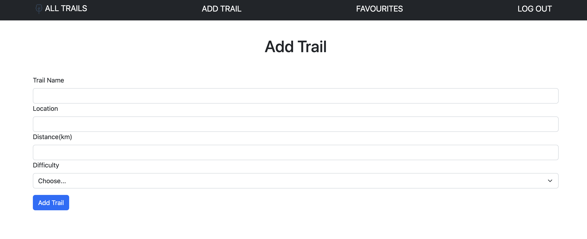

# **TeamTrailz**

## **[TeamTrailz Page](https://teamtrailz-sei.herokuapp.com/trails)**

## [TeamTrailz Trello](https://trello.com/b/FkPRj1gK/project-2-teamtrails)

TT has one goal, to build a strong community of outdoor enthusiasts who can collectively create their own encyclopedia of trails where each user can create trails that haven't been shared yet, add their personal experiences to each trail they've hiked, and favourite the ones they loved or plan to hike.

### **Landing Page**

### **Add Trail**

 

### **Technologies Used**

- HTML
- CSS
- Bootstrap
- JavaScript
- Node.js
- Express
- Mongoose
- Atlas
- Heroku

 

### **Icebox Items**

- Cleaner UI
- Individual user favourites lists w/ additional options (trip planners, favourites, etc)
- User able to add photo when creating trail vs. stock photo
- Main page: trails plotted on a google map
- Expansion on info provided for each trail --> suggested parking areas, what to pack, latest conditions, pet friendly, etc.
- Add google map to each trail info page
- User option to "like" trails --> X amount of hikers, similar to fb/insta likes
- Option for users to reply to comments --> Chain
- Different tiers for users --> ex. only mods can delete trails that have been added
